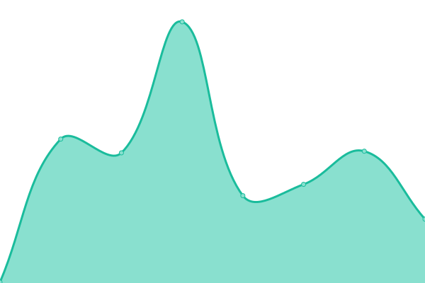

# [📈 Live Status](https://status.buildbuddy.io): <!--live status--> **🟩 All systems operational**

This repository contains the open-source uptime monitor and status page for [BuildBuddy](https://buildbuddy.io), powered by [Upptime](https://github.com/upptime/upptime).

With [Upptime](https://upptime.js.org), you can get your own unlimited and free uptime monitor and status page, powered entirely by a GitHub repository. We use [Issues](https://github.com/buildbuddy-io/buildbuddy-uptime/issues) as incident reports, [Actions](https://github.com/buildbuddy-io/buildbuddy-uptime/actions) as uptime monitors, and [Pages](https://status.buildbuddy.io) for the status page.

<!--start: status pages-->
<!-- This summary is generated by Upptime (https://github.com/upptime/upptime) -->
<!-- Do not edit this manually, your changes will be overwritten -->
<!-- prettier-ignore -->
| URL | Status | History | Response Time | Uptime |
| --- | ------ | ------- | ------------- | ------ |
|  [BuildBuddy Cloud](https://app.buildbuddy.io) | 🟩 Up | [build-buddy-cloud.yml](https://github.com/buildbuddy-io/buildbuddy-status/commits/HEAD/history/build-buddy-cloud.yml) | 

 132ms
     
 | 

<a href="https://status.buildbuddy.io/history/build-buddy-cloud">100.00%</a>
    

|  [BuildBuddy Website](https://www.buildbuddy.io) | 🟩 Up | [build-buddy-website.yml](https://github.com/buildbuddy-io/buildbuddy-status/commits/HEAD/history/build-buddy-website.yml) | 

 910ms
     
 | 

<a href="https://status.buildbuddy.io/history/build-buddy-website">99.69%</a>
    

|  [BuildBuddy Documentation](https://docs.buildbuddy.io) | 🟩 Up | [build-buddy-documentation.yml](https://github.com/buildbuddy-io/buildbuddy-status/commits/HEAD/history/build-buddy-documentation.yml) | 

 173ms
     
 | 

<a href="https://status.buildbuddy.io/history/build-buddy-documentation">100.00%</a>
    

|  [BuildBuddy Blog](https://blog.buildbuddy.io) | 🟩 Up | [build-buddy-blog.yml](https://github.com/buildbuddy-io/buildbuddy-status/commits/HEAD/history/build-buddy-blog.yml) | 

 181ms
     
 | 

<a href="https://status.buildbuddy.io/history/build-buddy-blog">100.00%</a>
    

<!--end: status pages-->

[**Visit our status website →**](https://status.buildbuddy.io)

## 📄 License

- Powered by: [Upptime](https://github.com/upptime/upptime)
- Code: [MIT](./LICENSE) © [BuildBuddy](https://buildbuddy.io)
- Data in the `./history` directory: [Open Database License](https://opendatacommons.org/licenses/odbl/1-0/)
